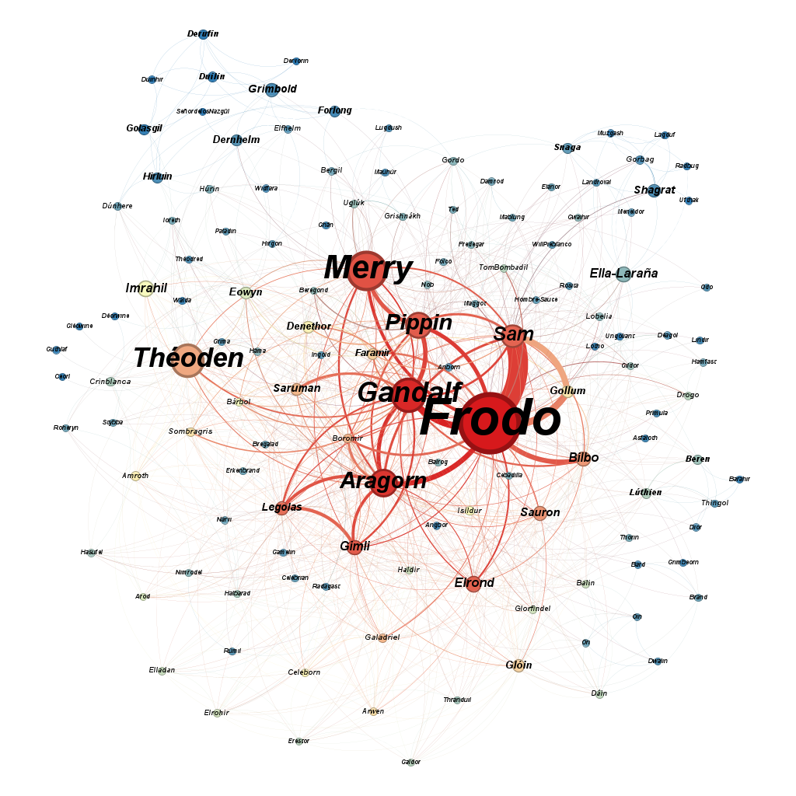
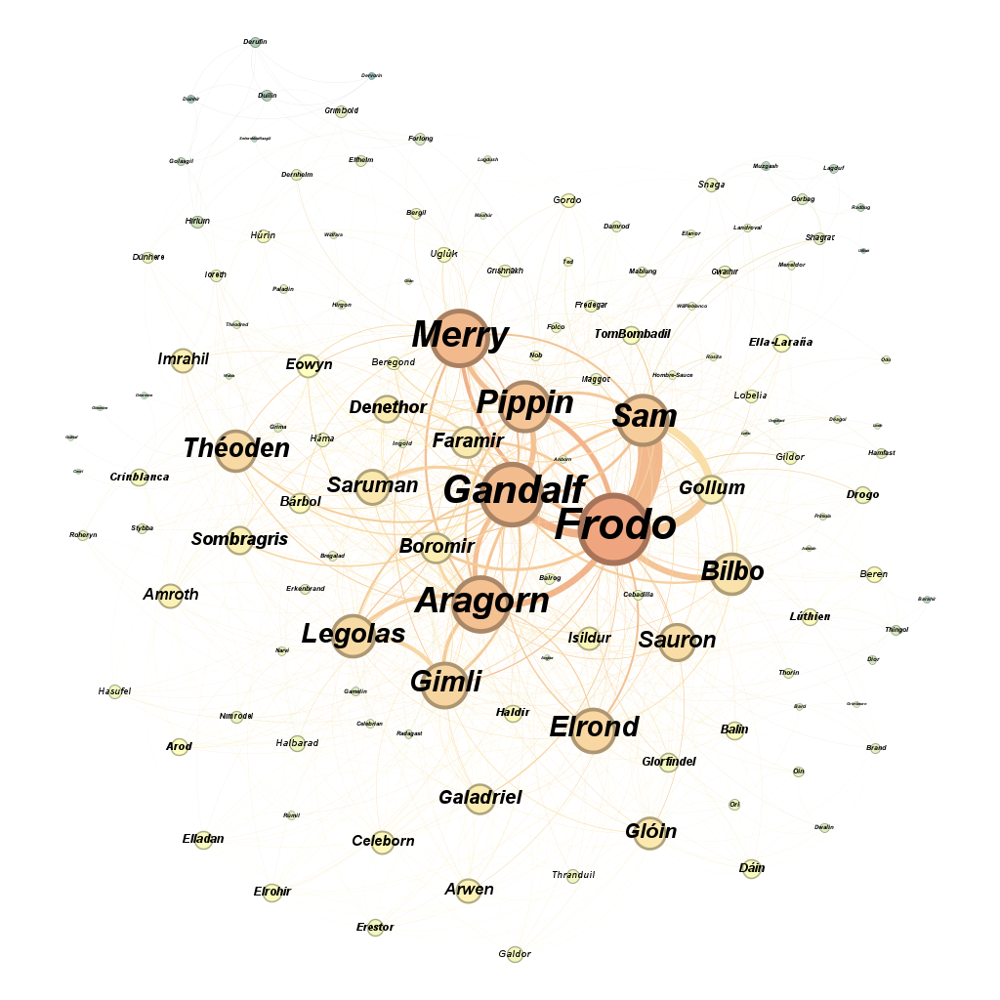
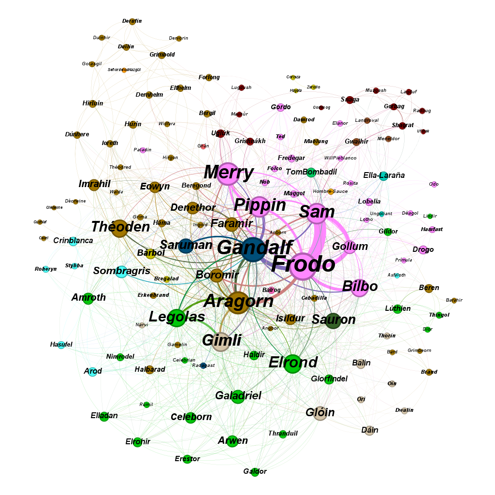
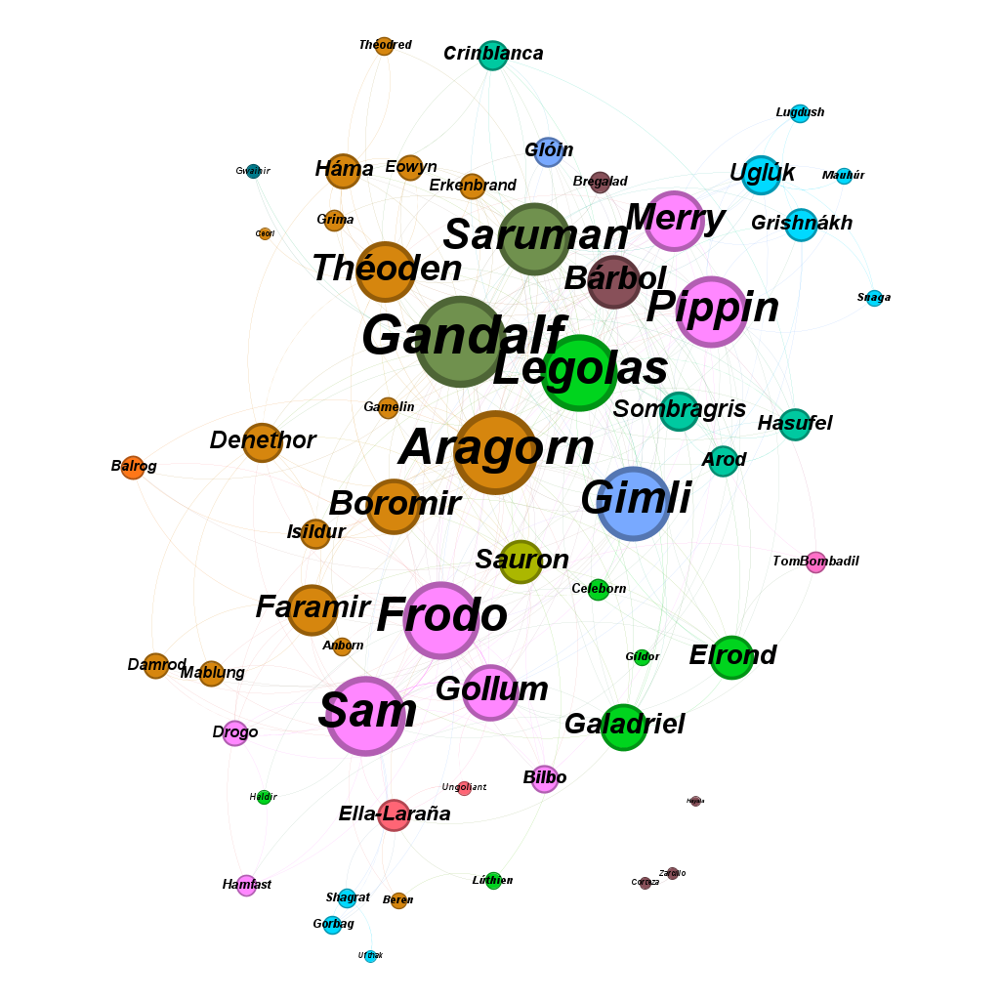
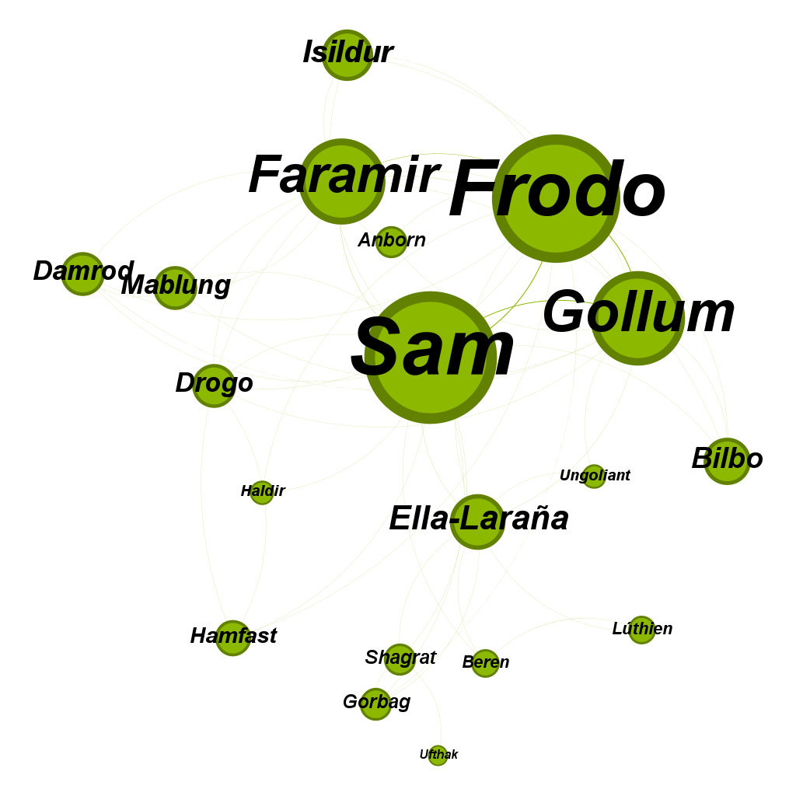
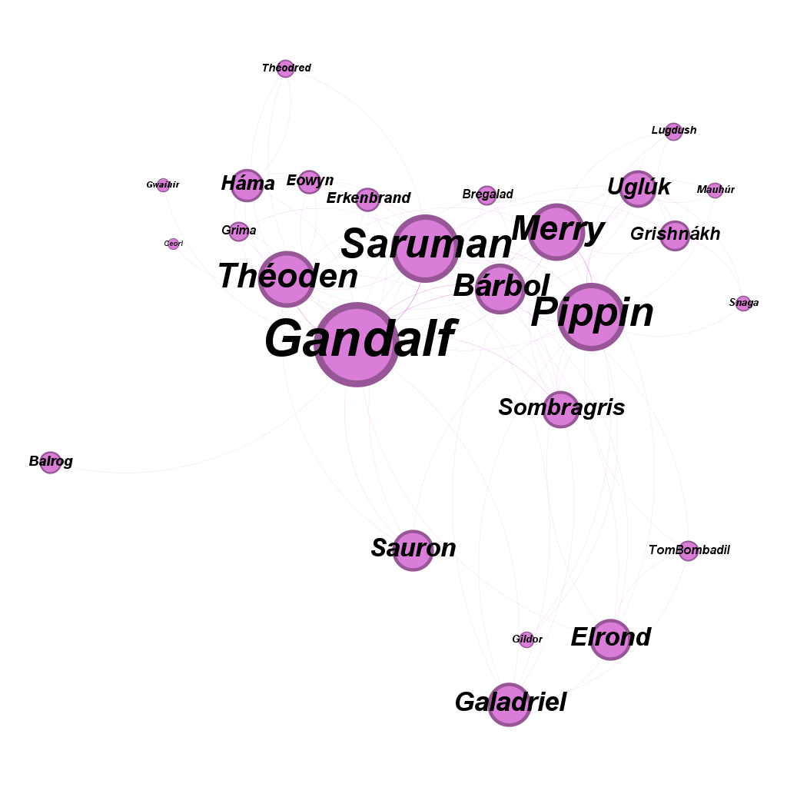
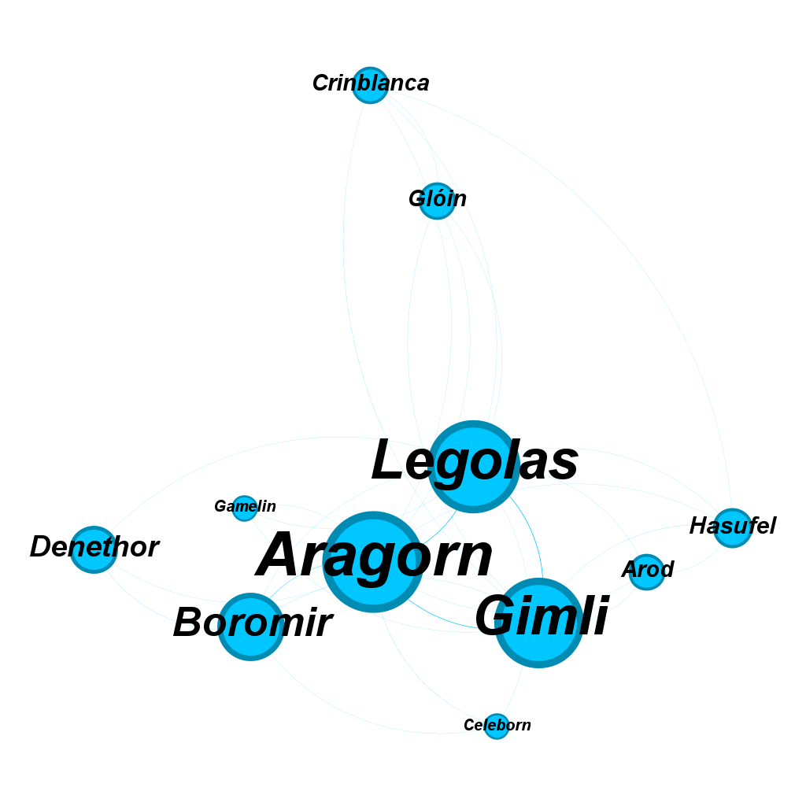

# 📜 Análisis de la Red Social en *El Señor de los Anillos*

Este repositorio contiene un análisis detallado de las relaciones entre los personajes de *El Señor de los Anillos* en español, utilizando técnicas de procesamiento de texto y análisis de redes.

## 📌 Descripción del Proyecto

El objetivo de este proyecto es construir una red de interacciones entre los personajes de la trilogía de *El Señor de los Anillos* a partir de los textos originales. Para ello, se han seguido los siguientes pasos:

1. **Extracción del texto:** A partir del libro original en formato pdf, he extraído el texto completo del libro y de cada una de las partes del mismo, se pueden encontrar en la raíz del proyecto en formato .txt.
2. **Extracción de personajes:** He creado una lista base con los personajes del señor de los anillos buscando en Internet. En esta lista se muestra el nombre del personaje y la etiqueta final que va a recibir, es decir, puede haber dos nombres como Aragorn y Trancos
   que hacen referencia al mismo personaje y por eso tienen la misma etiqueta final: Aragorn. Puedes encontrar la lista en: [personajes.csv](Personajes/personajes.csv).
3. **Búsqueda de menciones en los libros:** Se ha recorrido el texto para contar el número de apariciones de cada personaje.
4. **Generación de interacciones:** También se han contado el número de interacciones entre personajes. Para ello, cuando aparece un personaje se cuenta una ventana de 50 palabras hacia delante y 50 hacia atrás y si aparecen personajes distintos se suma 1 a su interacción.
5. **Agrupación por etiquetas:** Finalmente se ha agrupado por etiquetas para consolidar interacciones de nombres alternativos (Ej: "Trancos" y "Aragorn").
6. **Exportación a formatos compatibles con Gephi:** Para visualización de la red social se han exportado a formato csv los resultados: 
    - [personajes_final.csv](Personajes/personajes_final.csv): Nodos para Gephi con los nombres agrupados por etiquetas.
    - [interacciones_final.csv](Interacciones/interacciones_final.csv): Aristas para Gephi con las relaciones entre personajes.
    - También puedes encontrar los nodos y aristas para cada uno de los 3 libros por si se quieren analizar por separado.

## 📂 Estructura del Repositorio

```bash
├── 📁 Personajes
│   ├── personajes.csv  # Lista de personajes previa con nombre, etiqueta, raza, subraza y género.
│   ├── personajes_comunidad_anillo.csv  # Personajes en 'La Comunidad del Anillo'.
│   ├── personajes_dos_torres.csv  # Personajes en 'Las Dos Torres'.
│   ├── personajes_retorno_rey.csv  # Personajes en 'El Retorno del Rey'.
│   ├── personajes_final.csv  # Personajes en el libro completo.
│
├── 📁 Interacciones
│   ├── interacciones_comunidad_anillo.csv  # Red de interacciones para 'La Comunidad del Anillo'.
│   ├── interacciones_dos_torres.csv  # Red de interacciones para 'Las Dos Torres'.
│   ├── interacciones_retorno_rey.csv  # Red de interacciones para 'El Retorno del Rey'.
│   ├── interacciones_final.csv  # Red de interacciones para el libro completo.
│
├── 📁 Libros
│   ├── 1.ComunidadDelAnillo.pdf  # Pdf completo de 'La Comunidad del Anillo'.
│   ├── 2.LasDosTorres.pdf  # Pdf completo de 'Las Dos Torres'.
│   ├── 3.ElRetornoDelRey.pdf # Pdf completo de 'El Retorno del Rey'.
│   ├── Completo.pdf # Pdf completo de la suma de los 3 libros.
│   ├── Apendices.pdf # Pdf con los apéndices del libro.
│   ├── Prologo.pdf # Pdf con el prólogo del libro.
│   ├── El_Senor_de_los_Anillos.pdf # Pdf original con todo el libro.
│
├── 📁 Redes
│   ├── Fotos con ejemplos de visualizaciones de redes obtenidas.
│
├── 📁 Entrega
│   ├── Imagenes: Todas las imagenes utilizadas para la entrega.
│   ├── Excel: Medidas obtenidas tras el análisis.
│   ├── PDF: Memoria de la entrega final.
│
├── apariciones.py  # Código para extracción y análisis de apariciones e interacciones.
├── extracción_texto.py  # Código para extracción de texto a partir de pdfs.
├── README.md  # Documentación del proyecto
├── ComunidadDelAnillo.txt  # Texto extraído de 'La Comunidad Del Anillo'.
├── LasDosTorres.txt # Texto extraído de 'Las Dos Torres'.
├── ElRetornoDelRey.txt # Texto extraído de 'El Retorno Del Rey'.
├── Libro.txt # Texto extraído del libro completo (suma de las 3 partes).
```

## 🚀 Instalación y Uso

### 📥 Requisitos

- Python 3.8+
- Bibliotecas necesarias: `pandas`, `re`, `csv`

Instalar dependencias:

```bash
pip install pandas
```

### 📊 Generar la Red de Interacciones

Ejecutar el script principal:

```bash
python apariciones.py
```

Esto generará los archivos CSV de personajes e interacciones listos para su análisis en Gephi, aunque ya están disponibles en el repositorio y no es necesaria ninguna ejecución.

## 📈 Visualización en Gephi

1. Abrir **Gephi**.
2. Cargar los archivos CSV de interacciones y personajes (Se trata de un grafo no dirigido y ponderado).
3. Aplicar algoritmos de detección de comunidades y centralidad para analizar la estructura de la red.

## ✨ Resultados Destacados

- **Personajes con más apariciones** 📊
- **Personajes con más conexiones** 🔗
- **Comunidades dentro del mundo de Tolkien** 🏰

## 📷 Visualizaciones destacadas

A continuación se presentan algunas de las visualizaciones más representativas generadas en Gephi:

### 🔝 Personajes más importantes según medidas de centralidad



> El tamaño del nodo es proporcional a la intermediación y el color a la centralidad de vector propio.

---

### 🎯 Personajes con mayor grado y cercanía



> El tamaño indica el número de conexiones (grado) y el color representa la cercanía estructural en la red.

---

### 🌐 Red completa por razas



> Visualización de toda la red con colores según raza y tamaño proporcional al grado.

---

### 📘 Red de *Las Dos Torres*



> Visualización de la red de personajes del segundo libro, con mejor estructura modular.

---

### 🧑‍🤝‍🧑 Comunidades detectadas en *Las Dos Torres* (Lovaina)

#### Comunidad de Frodo



#### Comunidad de Gandalf



#### Comunidad de Aragorn




## 🤝 Contribuciones

Si quieres mejorar este análisis, ¡las contribuciones son bienvenidas! Puedes hacer un fork del repositorio y enviar un pull request con tus mejoras, me pueden faltar personajes o una detección más precisa de apariciones e interacciones en los libros.

## 📜 Referencias

- *El Señor de los Anillos*, J.R.R. Tolkien.
- Para la creación de la lista de personajes:
  - [Fandom](https://esdla.fandom.com/wiki/Categor%C3%ADa:Personajes_de_El_Se%C3%B1or_de_los_Anillos)
  - [Wikipedia](https://es.wikipedia.org/wiki/Categor%C3%ADa:Personajes_de_El_Se%C3%B1or_de_los_Anillos)

---

📩 **Contacto:** [PabloGradolph](https://github.com/PabloGradolph)  
🛠️ **Desarrollado por:** Pablo Gradolph Oliva

